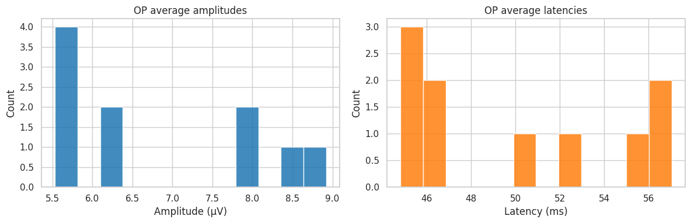
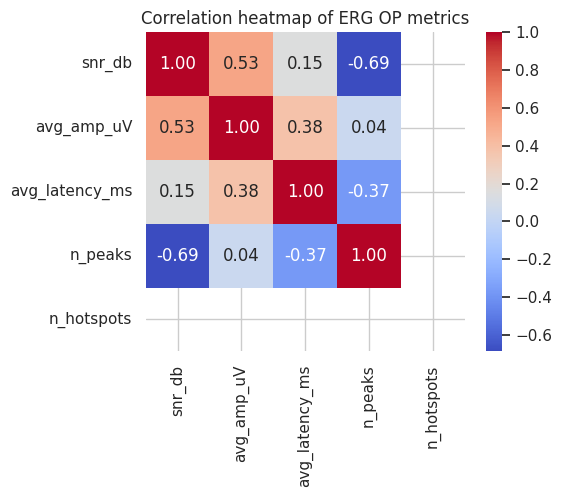

# Advanced Clinical ERG Batch Analyzer: Multi-Resolution Cohort Pipeline

## 🔬 Project Overview
This repository implements a high-throughput **Clinical ERG Processing Engine**. While standard analysis tools focus on single-signal inspection, this pipeline is designed for **large-scale cohort studies** (consistent with OculusGraphy database standards). 

The system automates the transition from raw clinical datasets to objective statistical biomarkers, using **Continuous Wavelet Transforms (CWT)** and **Gaussian Morphological Filtering** to extract Oscillatory Potentials (OPs) across hundreds of channels simultaneously.

### 🚀 Key Research Features:
*   **Batch Processing Architecture:** Automated iteration through multi-channel Excel/CSV datasets with dynamic data-block detection.
*   **Cohort Statistical Profiling:** Generation of population-level distributions for Amplitude and Latency.
*   **Data Integrity Verification:** Statistical correlation analysis between Signal-to-Noise Ratio (SNR) and physiological metrics.
*   **Automated Clinical Reporting:** Generates high-resolution PDF diagnostic reports for every individual channel processed.

---

## 📊 Visualized Research Insights

### 1. Population Normative Data
The engine extracts and plots the distribution of clinical metrics across the entire cohort, allowing for the immediate identification of outliers or pathological signatures.

*Figure 1: Population distributions for OP Amplitudes (µV) and Implicit Times (ms).*

### 2. Feature Correlation Heatmap
This visualization assesses the relationship between technical metrics (SNR) and clinical outcomes, ensuring the extracted features are statistically robust.

*Figure 2: Spearman/Pearson correlation matrix of ERG-OP parameters.*

### 3. Best-SNR Scalogram Analysis
The pipeline automatically identifies the signal with the highest fidelity to provide a benchmark time-frequency analysis using the **Ricker (Mexican Hat) wavelet**.

*Figure 3: Optimal time-frequency localization of OPs (30-60ms band) for the highest SNR subject.*

---

## 🛠 Methodology

1.  **Preprocessing:** 1D-Gaussian smoothing ($\sigma=2.0$) to suppress stochastic noise while preserving b-wave morphology.
2.  **Wavelet Extraction:** Implementation of CWT via `PyWavelets` to localize non-stationary high-frequency bursts (75-150 Hz).
3.  **Feature Extraction:** Automated peak/valley detection for calculating Peak-to-Peak Amplitude and Implicit Time.
4.  **Batch Export:** Comprehensive metrics are saved to `erg_op_summary.csv` for downstream statistical testing (SPSS/R).

---

## 🚀 Installation & Usage

### Prerequisites
* Python 3.9+
* Libraries: `numpy`, `pandas`, `scipy`, `matplotlib`, `pywavelets`, `seaborn`, `openpyxl`

### Setup

* git clone https://github.com/raianeyahiaoui/ERG-Batch-Analyzer.git
* cd ERG-Batch-Analyzer
* pip install -r requirements.txt

## Run Batch Pipeline
* python erg_batch_analysis.py

## 📁 Repository Structure
* erg_batch_analysis.py: Core processing engine.
* reports/: Automated PDF diagnostic reports for each channel.
* images/: Visualizations for the cohort analysis results.
* erg_op_summary.csv: Master dataset of extracted clinical metrics.
* 01 Appendix 1.xlsx: Raw clinical dataset (OculusGraphy format).

## 👨‍🔬 About the Author
* Yahiaoui Raiane
* Telecommunication Systems Engineer | AI Researcher
* 📧 Email: yahiaoui.raiane7@gmail.com
  
* This project is licensed under the MIT License – see the LICENSE file for details.
